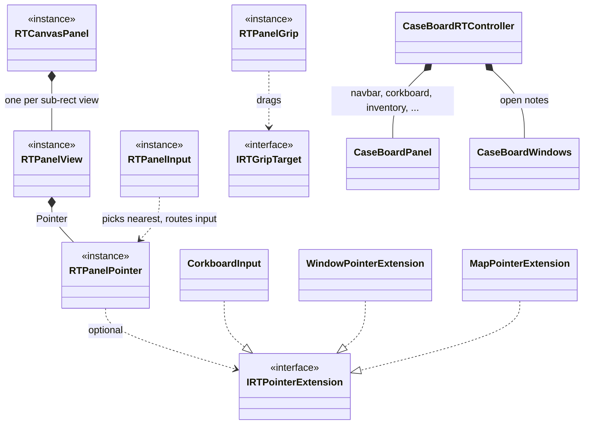

# SoDVR file map

Quick reference for how `SoDVR/VR/*.cs` fits together. A reference doc, not a design spec — see
`CLAUDE.md` for the splitting rules, `docs/v1_findings.md` for what has been tried and disqualified, and
`docs/postfx_immune_ui.md` for how the RT panels work.

All of the game's UI goes through one pipeline, **RT panels**: a game canvas is rendered by its own
projector camera into a texture and shown through world quads that `PostFXOverlayCompositor` draws
into each eye after HDRP's post stack (so depth of field, exposure and bloom never touch it). A
transparent panel renders its canvas outside HDRP (`TransparentUIRender`) so its background stays
see-through. Input goes through `RTPanelInput`; grip-dragging through `RTPanelGrip`.

Canvases a dedicated panel owns are named in `RTOwnedCanvases`; every other root screen canvas the
game puts up gets a generic panel from `LooseCanvasPanels`. The awareness compass (`3DUI`) is real
3D geometry and stays 3D (`CompassDisplay`).

## Composition — what `VRCamera` owns and calls

`VRCamera` is the `MonoBehaviour` coordinator. It holds orchestration only: it owns the subsystem
instances and calls static utility classes.

```mermaid
classDiagram
    class VRCamera {
        <<MonoBehaviour>>
        Update()
        LateUpdate()
        BuildCameraRig()
    }

    VRCamera *-- VoidRoomController : _voidRoom
    VRCamera *-- HeldItemTracker : _heldItem
    VRCamera *-- HudController : _hud
    VRCamera *-- LocomotionController : _locomotion
    VRCamera *-- FallDamage : _fallDamage
    VRCamera *-- ControllerPoses : _controllerPoses
    VRCamera *-- HandPointer : _handPointer
    VRCamera *-- RTPanelInput : _rtPanelInput
    VRCamera *-- RTPanelGrip : _rtPanelGrip
    VRCamera *-- MenuRTPanel : _menuRTPanel
    VRCamera *-- TooltipRTPanel : _tooltipRTPanel
    VRCamera *-- CaseBoardRTController : _caseBoardRT
    VRCamera *-- DialogueRTPanel : _dialogueRT
    VRCamera *-- MinimapRTPanel : _minimapRT
    VRCamera *-- HudRTPanels : _hudRT
    VRCamera *-- ScreenOverlays : _screenOverlays
    VRCamera *-- WorldMarksPanel : _worldMarks
    VRCamera *-- InteractLabelPanel : _interactLabel
    VRCamera *-- RadialMenuPanel : _radialMenu
    VRCamera *-- SoloScreens : _soloScreens
    VRCamera *-- LooseCanvasPanels : _looseCanvases
    VRCamera *-- CompassDisplay : _compass
    VRCamera *-- PostFXOverlayCompositor : _overlay

    VRCamera ..> CameraRig : calls (static)
    VRCamera ..> ComputerUse : calls (static)
    VRCamera ..> InputModeGuard : calls (static)
    VRCamera ..> PostProcessingOverride : calls (static)
    VRCamera ..> VRSettingsPanel : calls (static)
    VRCamera ..> CanvasDump : calls (static, F9)
```

(Also owned, not drawn: the clue, subtitle, keyboard and VR Settings panels.)

`*--` = VRCamera creates and owns the instance for its whole lifetime.
`..>` = a call with no ownership — VRCamera just invokes a static method.

Per frame, `Update` ticks the panels (through a load too, so they drop dead canvases at once), then reads the controller
poses → `MainHand` → `RTPanelGrip` → `HandPointer` → `RTPanelInput`, and the buttons (`LocomotionController`,
`RadialMenuPanel` for Y). `LateUpdate` poses what follows the head or the world (world marks, the
interact label, the compass), renders every panel's projector, renders the eyes, then composites
the panels, the lasers and the pointer dot into each eye with `PostFXOverlayCompositor`.

## RT panels

| File | Role |
|---|---|
| `RTCanvasPanel.cs` | One canvas → projector camera + mipmapped texture, shown through any number of `RTPanelView`s (each a sub-rect of the texture on its own world quad). Screen layout (`Attach`) or sheet layout (`AttachSheet`), opaque or transparent. Also `IsBehindInteractivePanel` (is a point behind a panel the player uses). |
| `TransparentUIRender.cs` | Renders a transparent panel's canvas outside HDRP, keeping coverage in alpha, with a depth-stencil for UI masks. |
| `AdditiveGraphics.cs` | Hides the lens-flare decals painted on black, which smear on transparent panels. |
| `RTPanelInput.cs` | Arbiter: casts the active hand's ray at every enabled pointer, gives the nearest one the frame's input, keeps a pressed panel captured until release. Raises `Pressed` before delivery. |
| `RTPanelPointer.cs` | Turns controller input into Unity pointer events for one view, as a mouse would send them: hover, press, drag, release, click, right-click (A), scroll. |
| `IRTPointerExtension.cs` | Hook for input the game's own handlers can't take from pointer events (pins and the map read the OS mouse). |
| `RTPanelGrip.cs` | Grip-drags any `IRTGripTarget` in 3D. |
| `PanelLayer.cs` | Stacking: the pause menu over everything in the scene, popups, tooltips, the keyboard and VR Settings over it. A higher layer draws over and takes the laser before a lower one, whatever the distances. |
| `RTOwnedCanvases.cs` | Names of the canvases dedicated panels own; the generic panels leave them alone. |
| `ModCanvas.cs` | A canvas of the mod's laid out like a game canvas, for game UI moved onto its own panel. |
| `MenuRTPanel.cs` | MenuCanvas (pause/main menu), incl. the Settings-button redirect and save-load click intercepts. |
| `TooltipRTPanel.cs` | TooltipCanvas: each dialog, context menu, quick-menu and tooltip is its own view, placed at the laser (dialogs in front of the head); on the top layer. |
| `CaseBoardRTController.cs` | The case board: open signal, board anchor, its panels and windows; hides the board behind a single screen (`SoloScreens`). |
| `CaseBoardPanel.cs` | One screen-layout case-board canvas (navbar, corkboard, inventory regions, location details, upgrades). |
| `CaseBoardWindows.cs` | WindowCanvas as a sheet: each open note in its own slot and view. |
| `CorkboardInput.cs` / `WindowPointerExtension.cs` | Corkboard pins, pan and links; an open note's pin button. |
| `DialogueRTPanel.cs` | DialogCanvas (conversations, phone calls). |
| `ConversationSpeechPanel.cs` | Subtitles: above the dialogue window in a conversation, on the HUD otherwise. |
| `ClueMessagePanel.cs` | The centre messages (clue notices), beside the dialogue window or on the HUD. |
| `VRControlsPanel.cs` | The mod's own controls, under the game's key hints: Menus and World pages on the case board, the World page in the world if switched on. |
| `MinimapRTPanel.cs` / `MapPointerExtension.cs` | The map window, body-locked or on the board; its drag, zoom and node picking. |
| `HudRTPanels.cs` | GameCanvas as one transparent sheet following the head's heading, laid out around the case board or a computer screen when one is up. |
| `ScreenOverlays.cs` | Culls the game's fades to black on GameCanvas (death, hospital) and logs any other screen-wide overlay the HUD sheet would carry. |
| `WorldMarksPanel.cs` / `WorldMarksHeadView.cs` | Objective pointers, NPC reaction indicators and speech bubbles at their targets in the world, judged on-screen from the head. |
| `InteractLabelPanel.cs` / `GameFrameBox.cs` | The name and actions of what the main hand points at, in the game's tooltip style. |
| `RadialMenuPanel.cs` / `SoloScreens.cs` | Y: tap opens the board; hold for a radial menu opening the inventory, upgrades, notebook or map on its own. |
| `LooseCanvasPanels.cs` | Every other root screen canvas (splash, prototype builder, anything new) on a grip-draggable panel of its own. |
| `VRKeyboardPanel.cs` | The on-screen keyboard for the game's text boxes. |
| `VRSettingsRTPanel.cs` / `VRSettingsPanel.cs` | The VR Settings window (the mod's config and the game's settings). |
| `PostFXOverlayCompositor.cs` | Draws the panels, lasers and the pointer dot into each eye RT after HDRP. |

## Other files

| File | Type | Role |
|---|---|---|
| `CameraRig.cs` | static | Stereo rig, RT panel textures/projectors/quads. |
| `ControllerPoses.cs` | instance | Both controllers' poses from OpenXR. |
| `MainHand.cs` | static | Which hand points, interacts and holds items; a trigger press on the other hand swaps. Shared by the menu laser and the world. |
| `HandPointer.cs` | instance | The main hand's world ray: where it lands (the game camera is aimed through that point, so the game's interaction ray from the eye meets it), the dot, optional beam, the label's text. |
| `CompassDisplay.cs` | instance | The 3D awareness compass (3DUI) at the player's feet. |
| `HudController.cs` | instance | The route arrow; the popup desktop-mode guard. |
| `ComputerUse.cs` | static | In-game computers: detection, view pullback, the game camera's aim at the screen. |
| `InputModeGuard.cs` | static | Keeps the game in mouse-and-keyboard mode. |
| `QuestGlyphs.cs` | static | Quest controller glyphs in place of the game's key glyphs (one postfix on `GetControlIcon`); trigger and grip follow the main hand. |
| `VRSettings.cs` / `GameSettingsBridge.cs` | static | The mod's config entries; the game's own settings. |
| `PostProcessingOverride.cs` | static | Forces DoF off (config switch). |
| `CanvasDump.cs` | static | F9 debug dump of every canvas. |
| `NativeInput.cs` | static | Win32 input injection. |
| `LocomotionController.cs` | instance | Movement, turning and the buttons forwarded to the game as keys. |
| `FallDamage.cs` | instance | The game's landing handler (fall damage, broken legs, landing sounds, trip knockdown, "Shafted"), reimplemented because the mod disables `FirstPersonController`, which runs it. |
| `HeldItemTracker.cs` | instance | Held items and arms following the controllers; the item arm on the main hand, the rig mirrored when that is the left. |
| `Rooms/VoidRoomController.cs` + `Rooms/VoidRoom.cs` | instance | The void room for pre-game screens — independent island. |
| `Plugin.cs` | BepInPlugin | Instantiates `VRCamera`, binds config. |
