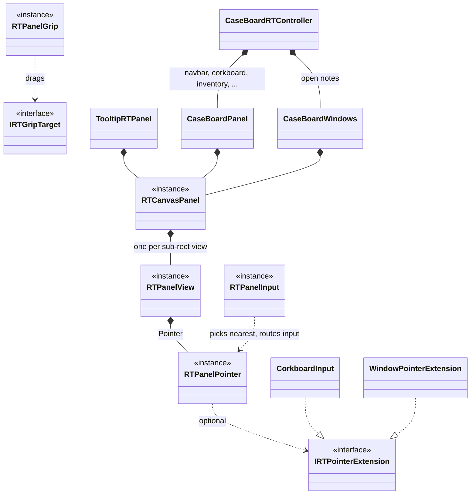
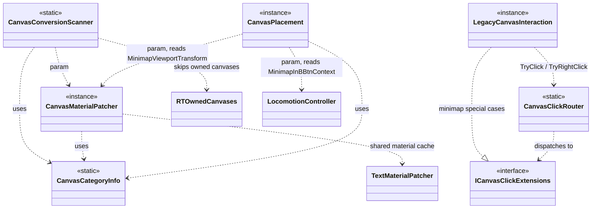

# SoDVR file map

Quick reference for how `SoDVR/VR/*.cs` fits together. A reference doc, not a design spec — see
`CLAUDE.md` for the splitting rules, `v1_findings.md` for why the legacy canvas pipeline is marked
disposable, and `postfx_immune_ui.md` for how the RT panels work.

The mod has two UI pipelines side by side:

- **RT panels** (durable): a game canvas is rendered by its own projector camera into a texture
  and shown through world quads drawn after HDRP's post stack. Owns the pause/main menu, the whole
  case board and TooltipCanvas (tooltips, menus, dialogs). Input goes through `RTPanelInput`.
- **Legacy WorldSpace canvases** (disposable): the base mod's approach — canvases converted to
  WorldSpace and placed in front of the player. Still owns everything no RT panel has taken over
  yet: the minimap, HUD, dialogue, computers, keyboard, fingerprints. The RT side names the canvases
  it owns in `RTOwnedCanvases`, and the legacy scanner and material patcher skip them.

## Composition — what `VRCamera` owns and calls

`VRCamera` is the `MonoBehaviour` coordinator. It holds orchestration only: it owns the subsystem
instances and calls static utility classes.

```mermaid
classDiagram
    class VRCamera {
        <<MonoBehaviour>>
        Update()
        LateUpdate()
        BuildCameraRig()
    }

    VRCamera *-- VoidRoomController : _voidRoom
    VRCamera *-- HeldItemTracker : _heldItem
    VRCamera *-- HudController : _hud
    VRCamera *-- LocomotionController : _locomotion
    VRCamera *-- ControllerInteraction : _controllerInteraction
    VRCamera *-- LegacyCanvasInteraction : _legacyCanvases
    VRCamera *-- CanvasMaterialPatcher : _materialPatcher
    VRCamera *-- CanvasPlacement : _canvasPlacement
    VRCamera *-- RTPanelInput : _rtPanelInput
    VRCamera *-- RTPanelGrip : _rtPanelGrip
    VRCamera *-- MenuRTPanel : _menuRTPanel
    VRCamera *-- TooltipRTPanel : _tooltipRTPanel
    VRCamera *-- CaseBoardRTController : _caseBoardRT
    VRCamera *-- PostFXOverlayCompositor : _overlay

    VRCamera ..> CameraRig : calls (static)
    VRCamera ..> CanvasConversionScanner : calls (static)
    VRCamera ..> PostProcessingOverride : calls (static)
    VRCamera ..> VRSettingsPanel : calls (static)
    VRCamera ..> CanvasDump : calls (static, F9)
    VRCamera ..> TextGraphicDump : calls (static, End)
```

`*--` = VRCamera creates and owns the instance for its whole lifetime.
`..>` = a call with no ownership — VRCamera just invokes a static method.

Per frame, `Update` ticks the RT panels (`MenuRTPanel`, `TooltipRTPanel`, `CaseBoardRTController`),
then the controller pose → grip (`RTPanelGrip`, then legacy grip) → legacy aim scan →
`RTPanelInput` → legacy trigger/A/B (`LegacyCanvasInteraction.Tick`, skipped when an RT panel has the
pointer). `LateUpdate` renders every RT panel's projector, renders the eyes, then composites RT
panels and the laser into each eye with `PostFXOverlayCompositor`.

## RT panels

| File | Role |
|---|---|
| `RTCanvasPanel.cs` | One canvas → projector camera + mipmapped texture, shown through any number of `RTPanelView`s (each a sub-rect of the texture on its own world quad). Screen layout (`Attach`) or sheet layout (`AttachSheet`). Also maps positions the game copied from another RT canvas (`TryMapFromOtherScreen`) and slides elements onto the texture (`MoveOntoTexture`). |
| `RTPanelInput.cs` | Arbiter: casts the active hand's ray at every enabled pointer, gives the nearest one the frame's input, keeps a pressed panel captured until release. Raises `Pressed` before delivery. |
| `RTPanelPointer.cs` | Turns controller input into Unity pointer events for one view, exactly as a mouse would send them: hover, press, drag, release, click, right-click (A), scroll. |
| `IRTPointerExtension.cs` | Hook for input the game's own handlers can't take from pointer events (pins read the OS mouse). |
| `RTPanelGrip.cs` | Grip-drags any `IRTGripTarget` in 3D. |
| `MenuRTPanel.cs` | MenuCanvas (pause/main menu), incl. the Settings-button and save-load click intercepts. |
| `TooltipRTPanel.cs` | TooltipCanvas: each dialog, context menu, quick-menu and tooltip is its own view, placed at the laser (dialogs in front of the head); drawn above every other panel. |
| `CaseBoardRTController.cs` | Coordinator for the case board: open signal, board anchor, its panels and windows. |
| `CaseBoardPanel.cs` | One screen-layout case-board canvas (navbar, corkboard, inventory regions, location details, upgrades). |
| `CaseBoardWindows.cs` | WindowCanvas as a sheet: each open note in its own slot and view. |
| `CorkboardInput.cs` | Corkboard extension: pin drag/click, board pan, string links (B, or the quick-menu's new link), A context menus. |
| `WindowPointerExtension.cs` | Open-note extension: the pin/unpin button. |
| `RTOwnedCanvases.cs` | Names of the canvases RT panels own, so the legacy pipeline never touches them. |
| `PostFXOverlayCompositor.cs` | Draws RT panels and the laser into each eye RT after HDRP. |

## The legacy canvas subsystem

`CanvasCategoryInfo` is the taxonomy every legacy canvas file depends on. These files never reach
back into VRCamera's fields; everything they need is passed in per call or via
`LegacyCanvasInteraction.SetFrameContext`.

`CanvasConversionScanner.PatchMenuSettingsButton` is called by `MenuRTPanel` (MenuCanvas is RT-owned)
to redirect the game's Settings button to `VRSettingsPanel`.

`CanvasClickRouter` still fires Buttons through `InvokeButtonClick` (persistent listeners only),
the base mod's approach. RT panels no longer use it: that path skips the game's
`ButtonController.OnPointerClick`, so any button whose action is an `OnLeftClick` override or an
`OnPress` subscriber does nothing (see `__pending_tasks.md` §7).

## Small, mostly-independent utility files

| File | Type | Depended on by |
|---|---|---|
| `CameraRig.cs` | static — stereo rig, RT panel textures/projectors/quads | `VRCamera`, RT panels |
| `PostProcessingOverride.cs` | static — forces DoF off (config) | `VRCamera` |
| `TextMaterialPatcher.cs` | static — shared material cache | `CanvasMaterialPatcher`, `TextGraphicDump`, `VRCamera` (clears it on scene reload) |
| `TextGraphicDump.cs`, `CanvasDump.cs` | static — End / F9 debug dumps | `VRCamera` |
| `NativeInput.cs` | static — Win32 input injection | `LocomotionController`, `LegacyCanvasInteraction`, `Rooms/VoidRoomController` |
| `VRSettingsPanel.cs` | static | several |
| `HudController.cs` | instance (`_hud`) | `VRCamera` |
| `HeldItemTracker.cs` | instance (`_heldItem`) | `VRCamera` |
| `Rooms/VoidRoomController.cs` + `Rooms/VoidRoom.cs` | instance (`_voidRoom`) | `VRCamera` — independent island |
| `Plugin.cs` | BepInPlugin entry point | instantiates `VRCamera`, binds config |

## Durable vs. disposable

- **Durable**: the RT panel files above, `PostFXOverlayCompositor.cs`, `ControllerInteraction.cs`
  (controller pose, laser, aim), `CameraRig.cs`.
- **Disposable** (the legacy pipeline — each canvas that moves to an RT panel takes its handling
  with it): `LegacyCanvasInteraction.cs`, `CanvasClickRouter.cs`, `CanvasCategoryInfo.cs`,
  `CanvasMaterialPatcher.cs`, `CanvasConversionScanner.cs`, `CanvasPlacement.cs`,
  `TextMaterialPatcher.cs`.
- **Orthogonal**: `NativeInput.cs`, `LocomotionController.cs`, `HeldItemTracker.cs`,
  `HudController.cs`, `Rooms/*`, `VRSettingsPanel.cs`, `PostProcessingOverride.cs`, the dumps.
