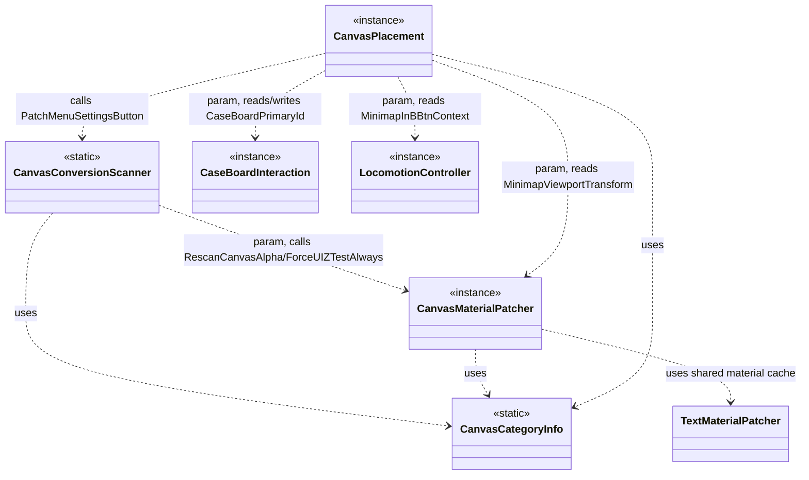
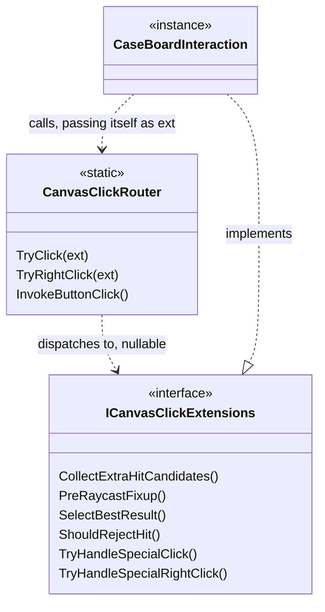

# SoDVR file map

Quick reference for how `SoDVR/VR/*.cs` fits together after the three file-splitting passes.
Generated as a reference doc, not a design spec — see `CLAUDE.md` for the splitting rules that
produced this shape and `v1_findings.md` for why the canvas subsystem is marked disposable below.

## Composition — what `VRCamera` owns and calls

`VRCamera` is the `MonoBehaviour` coordinator. It never implements subsystem logic itself anymore;
it owns instances of the subsystem classes as `readonly` fields, and calls static utility classes
for stateless/one-call-site work.

```mermaid
classDiagram
    class VRCamera {
        <<MonoBehaviour>>
        Update()
        LateUpdate()
        BuildCameraRig()
    }

    VRCamera *-- VoidRoomController : _voidRoom
    VRCamera *-- HeldItemTracker : _heldItem
    VRCamera *-- HudController : _hud
    VRCamera *-- LocomotionController : _locomotion
    VRCamera *-- ControllerInteraction : _controllerInteraction
    VRCamera *-- CaseBoardInteraction : _caseBoard
    VRCamera *-- CanvasMaterialPatcher : _materialPatcher
    VRCamera *-- CanvasPlacement : _canvasPlacement

    VRCamera ..> CameraRig : calls (static)
    VRCamera ..> CanvasConversionScanner : calls (static)
    VRCamera ..> CanvasCategoryInfo : calls (static)
    VRCamera ..> VRSettingsPanel : calls (static)
    VRCamera ..> PostProcessingOverride : calls (static)
    VRCamera ..> TextGraphicDump : calls (static, debug hotkey)

    class VoidRoomController { <<instance>> }
    class HeldItemTracker { <<instance>> }
    class HudController { <<instance>> }
    class LocomotionController { <<instance>> }
    class ControllerInteraction { <<instance>> }
    class CaseBoardInteraction { <<instance>> }
    class CanvasMaterialPatcher { <<instance>> }
    class CanvasPlacement { <<instance>> }
    class CameraRig { <<static>> }
    class CanvasConversionScanner { <<static>> }
    class CanvasCategoryInfo { <<static>> }
    class VRSettingsPanel { <<static>> }
    class PostProcessingOverride { <<static>> }
    class TextGraphicDump { <<static>> }
```

`*--` = VRCamera creates and owns the instance for its whole lifetime (`new()` field initializer).
`..>` = a call with no ownership — VRCamera just invokes a static method.

## The canvas subsystem — four files, one shared taxonomy

The three splitting passes produced a small pipeline. `CanvasCategoryInfo` is the only node every
other canvas-related file depends on; nothing depends on `VRCamera` in the reverse direction —
these files never reach back into VRCamera's fields, everything they need is passed in as a
parameter each call (see each file's own header comment for why: no shared "registry" object was
built, on purpose).

**Why `CanvasConversionScanner` and `CanvasPlacement` both call `PatchMenuSettingsButton`**: it
patches the game's Settings button once on first `MenuCanvas` discovery (scanner) and again on
every menu-open transition in case the game reinitialised buttons (placement). It returns `int?`
(the patched button's instance ID, or `null` if none found) instead of writing a field directly,
so both callers can assign `_menuSettingsBtnId` themselves without one file reaching into the
other's internals.

## The click-routing interface — the seam meant to survive a rewrite

This is the one deliberate abstraction in the whole mod. `CanvasClickRouter` is generic click
plumbing (hit testing, `GraphicRaycaster` invocation, `ExecuteEvents` fallback) that CLAUDE.md's
planned menu rewrite is expected to keep using; `CaseBoardInteraction` is case-board/minimap-specific
click behavior that rewrite is expected to delete outright. The interface is the seam between them:

A future menu rewrite deletes `CaseBoardInteraction.cs` wholesale and either implements
`ICanvasClickExtensions` on a new class, or has `VRCamera`/whatever replaces it pass `ext: null`.
`CanvasClickRouter.cs` itself never has to change.

## Small, mostly-independent utility files

These don't participate in the canvas pipeline at all — separate concerns, listed for completeness:

| File | Type | Depends on | Depended on by |
|---|---|---|---|
| `CameraRig.cs` | static | — | `VRCamera` only |
| `TextMaterialPatcher.cs` | static (shared material cache) | — | `CanvasMaterialPatcher`, `TextGraphicDump` |
| `TextGraphicDump.cs` | static (debug dump, End key) | `TextMaterialPatcher` | `VRCamera` only |
| `NativeInput.cs` | static (Win32 P/Invoke) | — | `LocomotionController`, `CaseBoardInteraction`, `Rooms/VoidRoomController` |
| `PostProcessingOverride.cs` | static | — | `VRCamera` only; config bound in `Plugin.cs` |
| `VRSettingsPanel.cs` | static | — | `LocomotionController`, `HeldItemTracker`, `CanvasMaterialPatcher`, `CanvasPlacement`, `CanvasClickRouter`, `VRCamera` |
| `HudController.cs` | instance (`_hud`) | — | `VRCamera` only |
| `HeldItemTracker.cs` | instance (`_heldItem`) | `VRSettingsPanel` | `VRCamera` only |
| `Rooms/VoidRoomController.cs` + `Rooms/VoidRoom.cs` | instance (`_voidRoom`) | `NativeInput` | `VRCamera` only — fully independent island, no canvas-subsystem coupling |
| `Plugin.cs` | BepInPlugin entry point | — | instantiates `VRCamera` via `AddComponent`, binds config for `PostProcessingOverride` + `VoidRoomController` |

## Durable vs. disposable — the fact that actually matters here

Per `CLAUDE.md` and `v1_findings.md`, the whole world-space-canvas-conversion approach is flagged
for eventual replacement by RenderTexture-projected panels. That maps directly onto which files
were written to be *relocated mechanically* (no redesign, safe to delete wholesale later) versus
which are expected to *survive* a rewrite conceptually:

- **Disposable** (deletion targets when the menu/interaction rewrite happens):
  `CaseBoardInteraction.cs`, `CanvasCategoryInfo.cs`, `CanvasMaterialPatcher.cs`,
  `CanvasConversionScanner.cs`, `CanvasPlacement.cs`.
- **Expected to survive** (canvas/interaction-specific generic plumbing a rewrite would still need):
  `CanvasClickRouter.cs` (via the `ICanvasClickExtensions` seam above), `ControllerInteraction.cs`,
  `TextMaterialPatcher.cs`.
- **Orthogonal** (not part of the canvas/interaction layer at all, no rewrite impact either way):
  `CameraRig.cs` (core VR stereo rendering, not UI), `NativeInput.cs` (general OS input injection,
  not canvas-specific), `LocomotionController.cs`, `HeldItemTracker.cs`, `HudController.cs`,
  `Rooms/VoidRoomController.cs`, `VRSettingsPanel.cs`, `PostProcessingOverride.cs`,
  `TextGraphicDump.cs`.

This is why the disposable files' headers explicitly say "not permanent architecture" and why they
weren't polished (duplicated logic left duplicated, long parameter lists instead of a shared
registry object) during the split — see each file's own header comment for the specific tradeoff
it declined.
